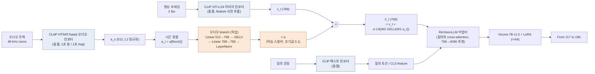
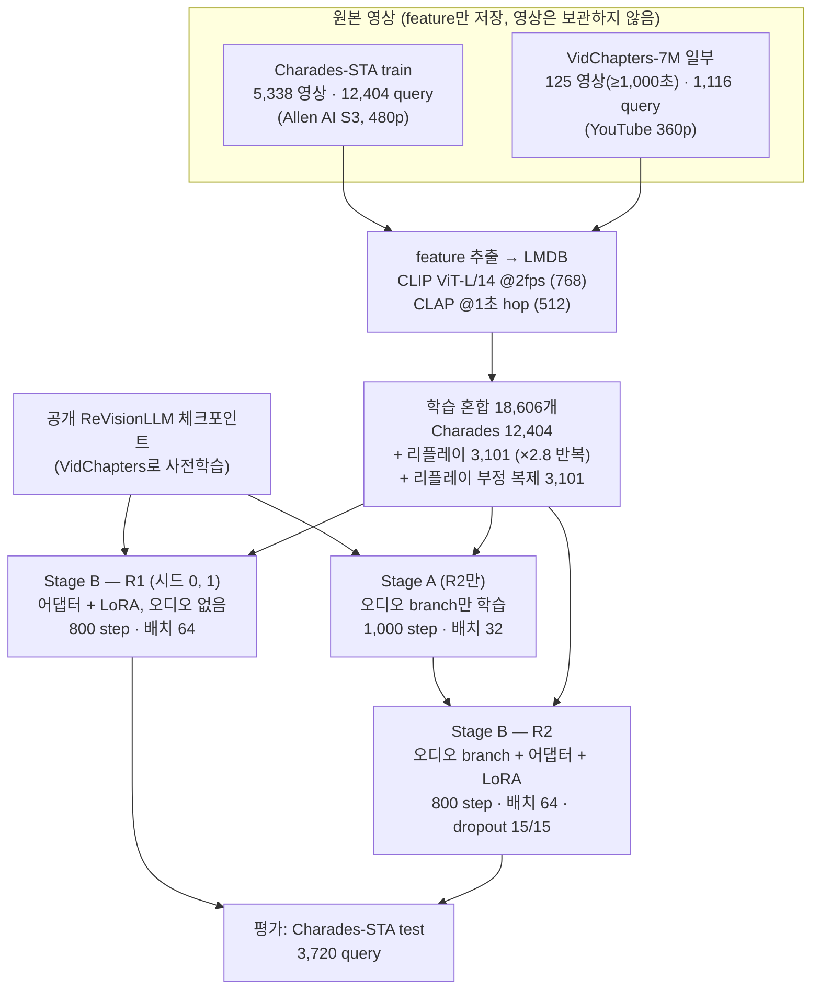

# 방법 (보고서용 초안)

공개 ReVisionLLM(영상 시간 구간 grounding LLM)에 **CLAP 오디오 branch**를 더하고, 같은 조건에서 오디오 없이 이어 학습한 모델(R1)과 비교한다. 이 문서는 *무엇을 어떻게 결합했고 어떤 데이터로 학습했는지*를 정리한다. 결과 수치는 포함하지 않는다.

- 과제: 영상과 문장 query가 주어지면 문장이 일어나는 구간을 출력한다. 출력은 250프레임 창 안의 프레임 번호이다(예: `From 117 to 199.`).
- 비교 모델: **R1** = 오디오 없음(visual-only), **R2** = 오디오 포함, **R4** = R2에서 추론 때만 오디오를 0으로 만든 대조군(추가 학습 없음), **R0** = 공개 체크포인트(미세조정 전).

---

## 1. 오디오 인코더의 결합 방식

### 그림 1. 모델 구조

- **융합 위치**: 어댑터에 들어가기 *전*의 CLIP 프레임 feature에 오디오 항을 더한다(코드: `vtimellm_arch.py`의 `fuse_audio`, `prepare_inputs_labels_for_multimodal` 시작부). 텐서 모양이 바뀌지 않아 LLM 입력 토큰 수와 이후 경로는 그대로이다.
- **수식**: ṽ_t = v_t + α · LN( W₂ · GELU( W₁ a_t + b₁ ) + b₂ )
  - a_t: 프레임 시각 t에 해당하는 1초 단위 CLAP 벡터(512). 프레임 t초 → `a[floor(t)]`.
  - W₁: 512→768, W₂: 768→768, LN: LayerNorm(768), α: 학습 가능한 스칼라 게이트.
  - **초기화**: W₂, b₂는 0, α는 0.1이다. 그래서 학습 시작 시 출력은 오디오 항이 0이라 공개 체크포인트와 동일하다. α와 W₂를 동시에 0으로 두면 모든 오디오 파라미터의 gradient가 0이 되어 학습이 시작되지 않으므로(실험으로 확인) α는 0이 아닌 0.1로 시작한다.
- **학습 파라미터 수**: 오디오 branch 986,113개(= 512·768+768 + 768·768+768 + LN 2·768 + α 1).
- **오디오 feature**: `laion/clap-htsat-fused`, 48 kHz mono, 1초 창·1초 hop, projected 512차원, fp16, L2 정규화(실측 norm 1.00). 오디오가 없는 영상은 0 벡터로 저장해 "무음"으로 처리한다(이번 Charades 6,672개 영상은 모두 오디오 트랙이 있었다).
- **영상 feature**: CLIP ViT-L/14 이미지 feature(768), 2 fps, fp16.
- **modality dropout**(R2의 Stage B만): 학습 샘플의 15%는 영상 feature를, 15%는 오디오 feature를 0으로 대체한다(샘플당 1회 추첨).

---

## 2. 학습 데이터

### 2.1 사용한 데이터

| 구분 | 데이터 | 용도 | 규모 | 출처·전처리 |
| --- | --- | --- | --- | --- |
| 사전학습(상속) | 공개 ReVisionLLM 체크포인트 (`stage1_sparse` 어댑터 + `stage2_long_100` LoRA) | 모든 모델의 출발점 | 저자가 VidChapters-7M으로 학습 | 저자 공개 가중치 (우리가 학습한 것이 아님) |
| **미세조정(주)** | **Charades-STA train** | R1, R2 학습 | 영상 5,338개, query 12,404개 | Allen AI 공개 480p mp4(S3). 문장·구간은 Charades-STA 주석. 구간이 영상 길이를 벗어나거나 길이 ≤ 0이 되는 4개 제외 |
| **미세조정(리플레이)** | **VidChapters-7M train 일부** | 긴 영상 감각 유지 | 영상 125개(길이 ≥ 1,000초), 원 query 1,116개 → **3,101개로 반복 샘플**(×2.8) | YouTube 360p를 yt-dlp로 받아 feature 추출. 부정 샘플("Not Present")용 복제 3,101개 추가 |
| 평가 | Charades-STA test | R0, R1, R2, R4 평가 | 영상 1,334개, query 3,720개 | 학습과 영상이 겹치지 않음(공식 분할) |

- 학습 항목 합계 **18,606개** = Charades 12,404 + 리플레이 3,101 + 리플레이의 부정 복제 3,101. 정답이 있는 항목 중 리플레이 비율은 20%(3,101/15,505).
- 부정 복제는 같은 긴 영상에서 정답이 없는 창을 골라 "Not Present"를 정답으로 둔 샘플이다. Charades(약 30초, 창이 하나)에서는 부정 창을 만들 수 없어 부정 복제를 만들지 않는다.
- 리플레이를 1,000초 이상 영상으로 제한한 이유: 학습 로더에 1,000초 미만 VidChapters 영상용 별도 시간 환산 경로가 있는데, 이 실험의 feature(전 영상 2 fps)와 맞는지 확인하지 못해 확실한 경로만 썼다.
- 리플레이 풀이 작은 이유: 계획했던 VidChapters 추출이 YouTube의 봇 차단으로 중단되어 저장된 Train 영상이 약 1,700개(그중 1,000초 이상은 125개)뿐이다.

### 2.2 입력 구성

| 항목 | Charades-STA (약 30초 영상) | VidChapters 리플레이 (긴 영상) |
| --- | --- | --- |
| 창 | 영상 전체를 **창 1개**로 보고 250프레임에 맞춤(프레임이 부족하면 균등 간격 복제) | 500초 창을 영상 안에서 골라 250프레임을 균등 샘플 |
| 정답 표기 | `From a to b.` (a, b = 0~249 프레임 번호, = 시각 ÷ 영상길이 × 250) | `From a to b.` (창 안 프레임 번호) 또는 `Not Present` |
| 질의 형식 | `<video>\nDuring which frames can we see {문장}?` (소문자, 끝의 마침표 제거) | 같음 |
| 질의 feature | CLIP ViT-L/14 텍스트(토큰 + CLS), 학습은 `<video>_<j>` 키, 테스트는 `c<idx>` 키 | `<video>_<j>` 키 |
| 오디오 정렬 | 샘플된 250프레임의 원래 시각으로 CLAP 1초 벡터를 선택 | 같음 |

### 그림 2. 데이터 흐름과 학습 단계

### 2.3 학습 설정

| 항목 | Stage A (R2만) | Stage B (R1, R2) |
| --- | --- | --- |
| 출발 가중치 | 공개 체크포인트 | R2: Stage A 결과 / R1: 공개 체크포인트 |
| 학습 대상 | 오디오 branch만(LoRA·어댑터·LLM 동결) | R2: 오디오 branch + 어댑터 + LoRA / R1: 어댑터 + LoRA |
| step × 유효 배치 | 1,000 × 32 (배치 2 × 누적 16) | 800 × 64 (배치 2 × 누적 32) |
| 학습률 | 1e-4 (오디오 branch는 ×10 = 1e-3) | 5e-5 (오디오 branch는 ×10 = 5e-4) |
| modality dropout | 0 | R2: 영상 15%, 오디오 15% |
| 소비 샘플 / 바퀴 수 | 3.2만 (약 1.7바퀴) | 5.1만 (약 2.8바퀴) |

공통: LoRA r=64, α=128 · Vicuna-7B v1.5(bf16, gradient checkpointing, SDPA 어텐션) · AdamW 계열 최적화, cosine 스케줄, warmup 3%, weight decay 0 · 시드 0(R1은 시드 1을 추가) · 1대의 RTX 3090(24GB)에 1 run.
이전 시험 run은 Stage A 500 step, Stage B 400 step이었다.

---

## 3. 평가 설정 (학습 데이터와 구분하기 위한 요약)

- 평가 데이터: Charades-STA test 3,720 query(영상 1,334개). 30초 영상은 창 1개이므로 계층 검색 없이 **밀집 단계 예측만** 쓴다.
- 지표: query마다 창별 예측 중 점수 1순위의 IoU. mIoU, R1@0.3/0.5/0.7(IoU가 임계값을 넘는 비율). 모델 간 차이는 query 단위 paired bootstrap으로 95% 신뢰구간을 구한다.
- R4(오디오 제거) 비교는 같은 가중치에서 입력만 바꾸므로 학습 시드 잡음이 들어가지 않는다.
- 정성 분석: R2는 맞고 R1·R4는 틀린 query(오디오 덕분), R2는 맞고 R1은 틀렸지만 R4도 맞는 query(오디오 무관), R2가 틀리고 R4가 맞는 query(오디오가 해침)를 모두 센다.

## 4. 재현 정보

- 코드 저장소: `ClipCraft-AI` (ReVisionLLM 기반). 오디오 branch `revisionllm/model/adapter/audio_fusion.py`, 학습 스크립트 `scripts/audio/`.
- 실행: `bash scripts/audio/charades.sh run` (긴 run은 `CKPT=checkpoints/audio_charades_long STEPS_A=1000 STEPS_B=800 EXTRA_R1_SEEDS=1 SKIP_R0=1`).
- 데이터 라이선스: Charades와 VidChapters-7M 모두 **비상업 연구용**이다. 사전학습 가중치(공개 ReVisionLLM)도 VidChapters/MAD로 학습되어 있어 상업 배포에는 쓸 수 없다.
- ClipCraft가 수정한 코드(오디오 branch 포함)는 이번 실험 전에 한 번도 실행된 적이 없었고, 실험 중 평가 코드의 transformers 4.41.2 호환 문제(생성 루프, 캐시 처리), 학습 로더의 짧은 영상 처리, 인자 중복 등을 수정했다(수정 내역은 저장소 이력 참고).
