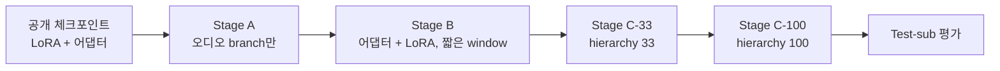

# ReVisionLLM 오디오 확장 실험 설계

## 목적과 가설

공개된 ReVisionLLM(VidChapters 체크포인트)에 CLAP 오디오 branch를 추가하고, 동일 조건의 visual-only 모델 대비 temporal grounding 성능이 오르는지 검증한다.

- **가설 H1**: audio-visual 모델은 visual-only 계속학습 모델보다 VidChapters 공식 test에서 mIoU와 R1@0.5가 높다.
- **가설 H2**: 이득은 발화, 음악, 박수, 웃음 등 오디오 단서가 있는 query에서 특히 크다.
- **가설 H3**: 오디오 branch는 실제 신호를 담는다. 시각 토큰을 제거한 audio-only 추론이 chance 수준을 넘는다.

성공 기준은 H1이다. H1이 성립하지 않아도 H2가 성립하면 ClipCraft 용도(오디오성 시나리오 문장)에서는 채택한다. 둘 다 실패하면 fusion 방식을 별도 토큰 방식(v2)으로 바꿔 한 번 더 시도한다.

**전제**: warm start를 쓰므로 "추가 학습 효과"와 "오디오 효과"를 분리해야 한다. 따라서 baseline은 공개 체크포인트가 아니라 같은 데이터·같은 step으로 이어서 학습한 visual-only 모델이다.

---

## 현재 목표: 1차 비교 (2026-10-04 확정)

아래 전체 설계(R0~R7, 시드 3개, Stage C까지)를 한 번에 하지 않는다. **먼저 최소 비교로 오디오 이득이 보이는지 확인**하고, 보이면 나머지를 확장한다.

| 항목 | 1차 비교 | 전체 설계 (후속) |
| --- | --- | --- |
| 비교 행 | **R0** (공개 체크포인트), **R1**(Stage B까지), **R2**(Stage A→B까지) | R0~R7 |
| 학습 단계 | Stage A, Stage B만. **Stage C(계층 학습) 생략** | Stage C-33 → C-100 포함 |
| 시드 | 1개 (시드 0) | 3개 |
| 평가 집합 | Test-sub 1,000 영상 (query 약 8,093개) | 동일 + Val-sub로 시드 선택 |
| Train-sub | **2,500시간** (약 1.6만 영상) | 1만 시간까지 확장 가능 |
| 추가로 보는 것 | R4 (R2 추론 시 오디오 0, 추가 학습 없음) | R3, R5~R7, H2 breakdown |

- **무엇을 주장할 수 있나**: 결과는 "시드 0, Stage B까지의 모델에서 관찰된 차이"이다. H1의 통계적 판정(시드 3개, CI)은 후속 단계의 몫이다. 1차 비교에서도 paired bootstrap CI와 R4(오디오 제거) 비교는 같이 보고한다.
- **R1·R2는 같은 조건**: 같은 데이터, 같은 step(Stage B 6,000), 같은 시드. 아래 학습 절차 표의 Stage C 행은 후속 단계다.
- **GPU**: 2장만 사용(타 사용자 공유). R1과 R2의 Stage B를 한 장씩 동시에 돌린다.
- **예상 소요**: 4090 기준 추정 약 1.7~2.2일(3090 환산 약 3~3.5일, 실측 전) + feature 추출. 학습·평가 시간은 아직 한 번도 실측하지 않았다.
- **1차 비교 후 판단**: 오디오 이득이 보이면 Stage C, 시드 추가, 보조 행(R3, R5~R7), 학습 데이터 확장으로 간다. 이득이 없으면 Stage C를 건너뛴 만큼 시간을 아낀 것이고, 부록의 CLAP 한계(음성 내용은 못 잡음)와 평가셋 선택을 먼저 재검토한다.

---

## 고정 설정 (feature 추출 전 확정)

원본 영상은 feature 추출 후 삭제하므로 아래 항목은 추출 전에 확정하고 이후 바꾸지 않는다.

| 항목 | 설정 | 이유 |
| --- | --- | --- |
| 베이스 체크포인트 | ReVisionLLM 공개 VidChapters stage2 (LoRA r=64) + stage1_sparse 어댑터 | ClipCraft 도메인이 YouTube에 가까움. MAD는 오디오 불가 |
| LLM | Vicuna-7B v1.5, bf16 | 공개 가중치와 동일. safetensors만 다운로드 |
| Visual encoder | CLIP ViT-L/14, 2fps, 768차원, fp16 | repo의 chapters stage2·eval 설정. stage1_sparse 플래그도 2로 통일 |
| Audio encoder | CLAP `laion/clap-htsat-fused`, 입력 48kHz mono, 1초 hop / 1초 window, projected 512차원, fp16 | 이벤트성 소리(박수·웃음)를 놓치지 않는 해상도. 512차원은 CLAP text와 같은 공간이라 후속 확장에 유리 |
| 오디오→프레임 정렬 | 1초 hop feature를 2fps grid에 nearest로 복제 (프레임 t초 → audio[floor(t)]) | additive fusion에 필요한 shape 일치. 저장은 1초 hop 원본만, 복제는 로더에서 수행 |
| Query text encoder | CLIP ViT-L/14 text (기존과 동일) | 어댑터 t2v cross-attn 입력. v1에서는 변경 없음 |
| 저장 형식 | LMDB, 영상 id를 key로 각 모달리티 별도 DB | 수만 개 npy보다 random access I/O가 빠름. 로더가 이미 지원 |
| 다운로드 화질 | 360p 영상 + 최고 품질 오디오 트랙 | CLIP은 224 처리라 360p로 충분. 오디오는 압축 손실 최소화 |
| 시드 | 데이터 샘플링 42, 학습 0 / 1 / 2 | 모든 ablation 행에 동일 적용 |

**보관 정책**: test 서브셋의 오디오 트랙만 원본 보관(약 20GB). 학습 서브셋의 원본은 feature 추출 직후 삭제한다.

---

## 데이터

VidChapters-7M의 공식 train/val/test split을 그대로 쓴다. train에서 자체 val을 떼지 않는다. 공개 체크포인트가 train 전체를 이미 학습했기 때문에 train에서 떼면 baseline 점수가 부풀린다.

| 집합 | 출처 | 규모 | 용도 |
| --- | --- | --- | --- |
| Train-sub | 공식 train에서 시드 42로 샘플링 | **현재 2,500시간(15,846 영상)**. 원안은 1만 시간(63,362 영상, 설계 문서의 "3만 영상"은 틀린 수치). 2,500시간 샘플은 1만 시간 샘플의 부분집합이라 나중에 이어서 늘릴 수 있다 | Stage A/B/C 학습, ablation 행 2·3 공통 |
| Val-sub | 공식 val에서 샘플링 | 300 영상 | 하이퍼파라미터, gate LR, modality dropout 비율 선택 |
| Test-sub | 공식 test에서 샘플링 | 1,000 영상 | 최종 보고. 모든 ablation 행에 동일 적용 |

### Train-sub 선정 규칙

1. 영상 길이 계층 샘플링: 5분 미만 20%, 5~20분 40%, 20~60분 30%, 60분 이상 10%. hierarchy 단계에 긴 영상이 필요하지만 짧은 영상이 학습 효율이 높다.
2. 오디오 트랙이 있고 무음 비율이 90% 미만인 영상만 포함.
3. 다운로드 실패(링크 소실, 지역 제한)는 같은 길이 구간에서 예비 후보로 대체. 목표는 영상 수가 아니라 총 시간 1만 시간.
4. Test-sub와 video id 교집합이 0임을 스크립트로 검증.

### Test-sub 선정 규칙

- 오디오 확보된 영상만 포함하고, 확정된 목록을 파일로 고정한다. 이후 모든 행이 이 파일을 읽는다.
- 길이 분포는 공식 test와 같게 유지한다. 논문 수치와 비교 가능성을 위해 임의 필터를 추가하지 않는다.
- query 유형 라벨을 붙인다. 키워드(music, song, talk, interview, laugh, applause, crowd, speech, sound 등)로 1차 분류하고, LLM으로 "오디오 단서 있음 / 없음" 2차 분류한다. 두 분류가 일치하는 query만 유형별 breakdown에 쓴다.

저장 용량은 영상 1시간당 CLIP 11MB + CLAP 4MB로 계산한다. Train-sub 1만 시간 기준 약 150GB, Test-sub와 Val-sub는 합쳐 10GB 미만이다.

---

## 모델 변경: additive fusion (v1)

오디오는 프레임 feature에 더해진다. 텐서 shape이 바뀌지 않으므로 hierarchy의 `b v t d` rearrange 경로와 LLM 입력 토큰 수는 그대로다.

$$\tilde{v}_t = v_t + \alpha \cdot \mathrm{LN}\big(W_2\,\mathrm{GELU}(W_1 a_t + b_1) + b_2\big)$$

- $v_t$는 CLIP 프레임 feature(768차원), $a_t$는 프레임 t에 정렬된 CLAP feature(512차원).
- $W_1$은 512→768, $W_2$는 768→768. $W_2$와 $b_2$는 0으로 초기화하고 게이트 $\alpha$는 학습 가능한 스칼라로 0에서 시작한다. 따라서 step 0에서 모델은 공개 ReVisionLLM과 완전히 동일하다.
- $\alpha$와 오디오 MLP에는 본체보다 10배 높은 learning rate를 준다. 시각에 이미 수렴한 모델이라 gradient가 작기 때문이다.

### 코드 변경 지점 (2026-09-19 구현 완료)

| 파일 | 변경 |
| --- | --- |
| `revisionllm/model/adapter/audio_fusion.py` (신규) | AudioFusion 모듈: `audio_fc_in`(512→768) + GELU + `audio_fc_out`(768→768, zero-init) + LN + 게이트 α(0 초기화). `(..., T, 768)` shape 보존 |
| `revisionllm/model/vtimellm_arch.py` | 융합 위치를 ClipEncoder 내부가 아니라 **모델 레벨(raw CLIP feature 단)** 으로 확정. `initialize_audio_modules` + `fuse_audio`가 linear projector, ClipEncoder(CLS), hierarchy, alternate의 dense 경로 모두에 적용됨. cross_attn/alternate_layer_norm 재생성 가드(hasattr) 추가해 `load_lora`가 로드한 가중치 보존 |
| `revisionllm/model/vtimellm_llama.py` | forward / generate에 `audio_feats`, `iteration_step` 통과 |
| `revisionllm/train/dataset.py` | `audio_feat_folder`(LMDB) 로드, 샘플된 프레임 인덱스 → nearest 1초 정렬, hierarchy 스택 동일 순서, 콜레이터에서 modality dropout(샘플당 1회 추첨), 전체 영상 feature LRU 캐시(기존은 무한 누적) |
| `revisionllm/train/train.py` | `--audio_fusion/--tune_audio_fusion/--freeze_audio_fusion/--tune_clip_adapter/--freeze_lora`, `--audio_lr_multiplier`, `--max_train_hours`(20h 종료 callback), 완료 가드, 어댑터·오디오 가중치를 항상 `non_lora_trainables.bin`에 저장, SDPA, deepspeed 선택 의존 |
| `revisionllm/train/vtimellm_trainer.py` | `create_optimizer` 오버라이드: audio_fusion param group에 LR × multiplier |
| `revisionllm/eval/audio_utils.py` (신규), `eval_nlq_negative.py`, `eval_nlq_retrieval_e2e2.py`, `inference.py` | 평가 시 윈도우별 오디오 정렬, `--drop_visual/--drop_audio`, `--video_ids`(Test-sub 고정), `--dense_iteration_step 1`로 fine-tune된 모델의 dense 경로를 그대로 평가 |
| `revisionllm/eval/metric_retrieval_forward_chapters.py`, `ablation_report.py` (신규) | 병합 per-query 로그 덤프, mIoU/R1@k, paired bootstrap 95% CI, H2 유형별 breakdown |
| `revisionllm/data/audio_pipeline/*` (신규) | 공식 split 샘플링, yt-dlp → CLIP 2fps + CLAP 1초 → LMDB rolling 추출(재개 가능, split 분할), 최종 리스트 확정·교집합 검증, query 유형 라벨링(키워드 + Claude) |
| `scripts/audio/*.sh`, `requirements.txt`, `scripts/chapters/stage1_sparse.sh` | 단일 GPU Stage A/B/C·평가·리포트·데이터 파이프라인 스크립트, torch 2.4 환경, feature_fps 5→2 통일 |

**Modality dropout**: 학습 샘플의 15%는 시각 feature를 0으로, 15%는 오디오 feature를 0으로 대체한다. 나머지 70%는 둘 다 사용한다. 무음 구간은 CLAP feature가 자연스럽게 다르므로 별도 처리하지 않는다.

**v2 후보** (v1이 H1·H2 모두 실패할 때만): 오디오를 별도 토큰 시퀀스로 넣고 modality embedding을 더한 뒤 t2v cross-attn과 CLS pooling이 두 모달리티를 함께 보도록 한다. 이 경우 hierarchy 코드의 rearrange를 모두 수정해야 한다.

---

## 학습 절차 (RTX 4090 1장)

세 단계를 순서대로 진행하며, 각 단계는 이전 단계의 출력을 입력으로 받는다. 원본의 stage1_dense는 공개 가중치에 이미 반영되어 있어 생략한다.

visual-only baseline(ablation 행 2)은 Stage B부터 같은 절차를 오디오 입력 없이 동일 step으로 돌린다.

| 단계 | 학습 대상 | 데이터 설정 | 유효 배치 | LR | Step | 4090 소요 (run당) | 목적 |
| --- | --- | --- | --- | --- | --- | --- | --- |
| A | audio_proj + α만. LoRA·어댑터·LLM freeze | hierarchy off, window 500초, 250프레임, neg_window on | 32 (배치 2 × 누적 16) | 1e-3 | 2,000 | 약 4시간 | 오디오 branch를 기존 표현 공간에 정렬 |
| B | audio_proj, 어댑터, LoRA | A와 동일 + modality dropout 15/15 | 64 (배치 2 × 누적 32) | 본체 5e-5, 오디오 5e-4 | 6,000 | 약 1~1.5일 | 오디오를 반영한 짧은 구간 grounding |
| C-33 | LoRA만. 어댑터·audio_proj freeze | hierarchy on, 33 하위영상, 250프레임 | 32 (배치 1 × 누적 32) | 5e-5 | 3,000 | 약 12시간 | coarse 단계 재정렬 |
| C-100 | LoRA만 | hierarchy on, 100 하위영상 | 32 (배치 1 × 누적 32) | 3e-5 | 3,000 | 약 1일 | 시간 단위 영상 대응 |

**소요 시간 산출 근거**: LLM에 들어가는 시퀀스가 짧다. hierarchy off에서는 영상이 CLS 토큰 1개로 압축되어 프롬프트 포함 약 200토큰, hierarchy 100에서도 약 320토큰이다. 7B bf16에서 micro-batch 하나의 forward+backward는 gradient checkpointing과 neg_window 샘플을 포함해 약 0.5초(Stage A·B), hierarchy 100에서는 어댑터가 하위영상 100개 × 251토큰을 처리해 약 0.7초다. 여기에 누적 횟수를 곱하면 step당 A 7초, B 16초, C-33 13초, C-100 22초가 나온다. hierarchy 단계는 샘플당 LMDB 읽기가 12~37MB라 I/O가 병목이 될 수 있다. 단, alternate 모드는 데이터셋이 콜레이터의 step 패리티를 읽어야 해서 worker를 0으로 두어야 하므로(Stage C), 대신 영상 feature LRU 캐시(128개)와 OS 페이지 캐시로 보완한다. Stage A/B는 worker 4를 쓴다.

**전체 GPU 시간**: Stage A 시드 3개(0.5일) + Stage B R1·R2 × 시드 3개(약 7일) + Stage C R1·R2(약 3일) + 보조 행 R5·R6(각 B+C, 약 5일) + Test-sub 평가 10행(약 2일) = 약 18일. 다운로드와 병행하면 전체 일정 안에 들어간다.

### 1일 실행 제한에 따른 분할

한 번에 최대 1일만 돌릴 수 있으므로 1일을 넘거나 여유가 없는 run은 같은 스크립트를 두 번 제출해 이어 돌린다. 한 job은 안전 마진을 두어 최대 20시간만 쓴다.

| 단계 | run당 시간 | job 수 | job당 step | job당 예상 시간 |
| --- | --- | --- | --- | --- |
| Stage A | 4시간 | 1 | 2,000 | 4시간 |
| Stage B | 1~1.5일 | 2 | 3,000 | 13~18시간 |
| Stage C-33 | 12시간 | 1 | 3,000 | 12시간 |
| Stage C-100 | 1일 | 2 | 1,500 | 11시간 |
| Train-sub feature 추출 | 1일 | 2 이상 | 영상 목록 절반씩 | 12시간 |
| Test-sub 평가 | 4시간/행 | 행당 1 | — | 4시간 |

분할 run이 한 번의 학습과 동일한 결과를 내려면 아래 네 가지를 지킨다.

1. `--max_steps`는 항상 전체 step(예: Stage B 6,000)으로 고정한다. cosine 스케줄과 warmup이 전체 길이 기준으로 계산되어야 두 job을 이어붙였을 때 한 번에 돌린 것과 같아진다.
2. 시간 기반 종료 callback을 넣는다. 경과 20시간이 되면 체크포인트를 저장하고 종료한다. step 수로 나누는 것보다 안전하고, 예상보다 느려도 job이 죽지 않는다.
3. 체크포인트는 500 step마다 저장하고 optimizer, scheduler, RNG 상태를 포함한다(HF Trainer 기본). DeepSpeed를 쓰지 않으므로 원본 스크립트의 `zero_to_fp32` 변환 루프는 제거한다. 강제 종료되더라도 손실은 최대 500 step이다.
4. 스크립트는 시작 시 출력 폴더의 마지막 체크포인트를 자동 감지해 `--resume_from_checkpoint`로 이어간다. 실행 인자는 두 job이 완전히 같고, trainer_state의 global_step이 max_steps에 도달하면 즉시 종료한다.

modality dropout과 데이터 순서는 RNG 상태 복원으로 이어지므로 분할 여부가 결과에 영향을 주지 않는다. 단, 재개 시 HF Trainer가 이미 본 배치를 건너뛰기 위해 dataloader를 빈 순회하는데, lazy 로더라 수 분 정도 걸린다. Train-sub feature 추출은 LMDB에 이미 있는 영상 id를 건너뛰도록 해서 같은 스크립트를 반복 제출하면 재개된다.

원본은 유효 배치 128, LR 1e-4이지만 warm start는 기존 표현을 흔들지 않는 것이 중요하므로 본체 LR을 낮추고 배치도 줄였다. warmup 3%, cosine 스케줄, weight decay 0, bf16, gradient checkpointing은 원본과 같다.

### 공통 설정

- DeepSpeed를 쓰지 않고 HF Trainer로 단일 GPU 실행. VRAM이 22GB를 넘으면 `--bits 4` QLoRA로 전환하되, 이 경우 ablation 모든 행을 같은 정밀도로 맞춘다.
- 환경: torch 2.4 + CUDA 12.1, transformers 4.41.2 유지, flash-attn 대신 SDPA 사용. monkey patch는 비활성화.
- 체크포인트는 500 step마다 저장, 최근 2개만 유지. 각 단계 끝에 Val-sub로 mIoU를 잰다.
- Stage A에서 α가 200 step 내에 0.05 이상으로 움직이지 않으면 오디오 LR을 3배로 올리고 재시작한다.

시드 0, 1, 2로 세 번 반복하는 것은 Stage B까지만 하고, Stage C는 Val-sub가 가장 높은 시드 하나로만 진행한다. 4090 시간 예산 때문이다.

---

## 평가와 ablation

지표는 repo의 metric 스크립트 그대로 mIoU, R1@0.3, R1@0.5, R1@0.7을 쓴다. 주지표는 R1@0.5다. 모든 행은 같은 Test-sub 목록, 같은 hierarchy 100 추론 설정, 같은 window로 평가한다.

### 주 비교표 (H1)

| 행 | 모델 | 학습 | 역할 |
| --- | --- | --- | --- |
| R0 | 공개 체크포인트 | 없음 | 논문 수치 재현 확인. Test-sub가 공식 test를 대표하는지 검증 |
| R1 | visual-only 계속학습 | Stage B→C, 오디오 입력 없음, 동일 step·데이터·시드 | 진짜 baseline |
| R2 | audio-visual (제안) | Stage A→B→C | 제안 모델 |

오디오 이득 = R2 − R1. 시드 3개의 평균과 표준편차를 보고하고, R1@0.5 차이에 대해 paired bootstrap(query 단위, 1,000회)으로 95% 신뢰구간을 붙인다. 신뢰구간이 0을 포함하지 않으면 H1 성립.

### 보조 ablation

| 행 | 설정 | 검증 대상 |
| --- | --- | --- |
| R3 | R2 모델, 추론 시 시각 feature 0 (`--drop_visual`) | H3. 오디오 branch가 단독으로 신호를 담는지 |
| R4 | R2 모델, 추론 시 오디오 feature 0 (`--drop_audio`) | R1과 비교해 시각 경로가 훼손되지 않았는지 |
| R5 | R2와 동일, modality dropout 없음 | dropout이 오디오 무시를 막는지. R3이 chance로 떨어지면 근거 |
| R6 | R2와 동일, Stage A 생략 | 오디오 warm-up 단계의 필요성 |
| R7 | R2 모델, Stage B까지만 (hierarchy 미학습) | Stage C가 오디오 이득을 유지하는지 |

R5부터 R7은 시드 0 하나로만 돌린다.

### Query 유형별 breakdown (H2)

Test-sub query를 "오디오 단서 있음"과 "없음" 두 그룹으로 나눠 R1과 R2의 R1@0.5를 각각 보고한다. 그룹 크기가 100 query 미만이면 Test-sub를 늘린다. 예상 결과는 오디오 그룹에서 큰 이득, 비오디오 그룹에서 0 또는 소폭 이득이다. 비오디오 그룹이 하락하면 오디오가 시각 경로를 방해한 것이므로 α 정규화를 추가한다.

**정성 분석**: 오디오 그룹에서 R1은 틀리고 R2는 맞춘 query 10개, 그 반대 10개를 골라 예측 구간과 해당 구간의 CLAP 최근접 태그(음악, 박수, 발화 등)를 함께 시각화한다.

**추가 평가 (선택)**: QVHighlights 공식 val에서 R1·R2를 제로샷 평가해 cross-dataset 일반화를 본다. 오디오가 있고 영상이 짧아(150초) 비용이 작다.

---

## 저장·시간 예산

총 저장 900GB 중 약 360GB를 쓰고, 전체 일정은 다운로드 2~3주와 GPU 작업 약 18일이 일부 겹쳐 약 6~7주를 잡는다.

| 항목 | 용량 |
| --- | --- |
| 가중치 (Vicuna-7B safetensors, CLIP, CLAP, VTimeLLM, ReVisionLLM 공개) | 20GB |
| conda 환경 + CUDA | 20GB |
| 학습 체크포인트 (run당 최근 2개, 시드 3개 × 행 R1·R2 + 보조 행) | 40GB |
| 원본 영상 임시 버퍼 | 100GB |
| Train-sub feature (CLIP + CLAP, 1만 시간) | 150GB |
| Val-sub + Test-sub feature | 10GB |
| Test-sub 오디오 원본 보관 | 20GB |
| **합계** | **360GB** |

| 작업 | 예상 소요 | 병목 |
| --- | --- | --- |
| 환경 구축 + 공개 체크포인트 추론 재현 (R0) | 3일 | 환경 호환성 |
| Test-sub·Val-sub 다운로드 + feature 추출 | 2일 | 네트워크 |
| Train-sub 다운로드 (약 3TB 전송) + feature 추출 | 2~3주 | 네트워크, YouTube 속도 제한 |
| 코드 변경 + 단위 확인 (audio=None일 때 출력 동일성) | 3일 | 없음. 다운로드와 병행 |
| Stage A (시드 3개 × 4시간) | 0.5일 | GPU |
| Stage B (R1·R2 × 시드 3개 × 1~1.5일) | 7일 | GPU |
| Stage C-33 + C-100 (R1·R2 × 시드 1개 × 1.5일) | 3일 | GPU |
| 보조 행 R5·R6 (각 Stage B+C), R7은 평가만 | 5일 | GPU |
| Test-sub 평가 (행당 약 4시간 × 10행) | 2일 | GPU |

GPU 작업만 합치면 약 18일이고, 다운로드와 겹치므로 전체 일정은 약 6~7주다.

다운로드와 코드 작업을 병행하면 GPU 작업은 Train-sub가 절반만 모여도 Stage A부터 시작할 수 있다. Train-sub feature 추출(CLIP L/14, 1만 시간 × 2fps = 7,200만 프레임)은 4090에서 약 1일이라 다운로드 속도를 따라간다.

---

## 리스크와 대응

| 리스크 | 징후 | 대응 |
| --- | --- | --- |
| 오디오 branch가 학습되지 않음 (시각 수렴 모델의 gradient 부족) | Stage A에서 α가 0 근처에 머물고 R3이 chance 수준 | 오디오 LR 3배 상향, modality dropout 비율 15→30%, α 초기값 0.1로 변경 |
| 공개 체크포인트 재현 실패 (R0이 논문 수치와 크게 다름) | R0의 R1@0.5가 논문 대비 3포인트 이상 낮음 | feature fps·window·prompt 템플릿 재확인. Test-sub 샘플링이 원인이면 재샘플링. 그래도 다르면 재현 수치를 baseline으로 보고하고 차이를 명시 |
| 평균 이득이 작음 (chapter query 대부분이 시각 중심) | R2 − R1의 신뢰구간이 0을 포함 | H2 유형별 결과를 주 결과로 보고. QVHighlights 추가 평가 |
| 오디오가 시각 경로를 방해 (비오디오 그룹 하락) | R4 < R1 | α에 L2 정규화 추가, Stage C에서 audio_proj freeze 유지 |
| YouTube 다운로드 제한으로 Train-sub 미달 | 일일 수집량이 목표 대비 50% 미만 | 목표를 5천 시간으로 낮추고 step 수는 유지. 데이터 규모를 보고에 명시 |
| VRAM 부족 (bf16 base가 24GB 초과) | OOM | `--bits 4` QLoRA로 전환. 모든 행을 같은 정밀도로 재실행 |
| flash-attn 미지원으로 속도 저하 | step당 시간이 예상의 2배 | SDPA로도 시퀀스가 짧아 영향 적음. 필요 시 flash-attn 2.6 이상 재빌드 |
| test 영상 오디오 확보 실패로 평가 집합이 편향 | 오디오 확보율 70% 미만 | 확보된 집합과 공식 test의 길이·카테고리 분포를 비교해 보고. R0를 두 집합 모두에서 평가해 대표성 확인 |

---

## 실행 순서 체크리스트

- [ ] torch 2.4 + CUDA 12.1 환경 구축, SDPA로 공개 체크포인트 추론 1건 성공
- [ ] Test-sub 1,000 / Val-sub 300 목록 확정 (시드 42, 오디오 확보 확인, 목록 파일 고정)
- [ ] Test-sub query 유형 라벨링 (키워드 + LLM, 일치하는 것만 채택)
- [ ] CLIP 2fps + CLAP 1초 hop 추출 스크립트 작성, LMDB 저장, Test-sub에 먼저 적용
- [ ] R0 평가: 공개 체크포인트를 Test-sub에서 돌려 논문 수치와 비교
- [ ] Train-sub 다운로드 + feature 추출 파이프라인 가동 (rolling 삭제, 재개 가능하게 진행 로그 기록)
- [ ] Train-sub ∩ Test-sub video id 교집합 0 검증
- [ ] 코드 변경 6개 파일 적용. audio=None일 때 공개 체크포인트 출력과 bit 단위 동일한지 확인
- [ ] stage1_sparse 스크립트의 feature_fps를 2로 수정
- [ ] 단일 GPU용 Stage A/B/C 스크립트 작성 (DeepSpeed 제거, 누적 배치, param group, 20시간 종료 callback, 마지막 체크포인트 자동 재개)
- [ ] Stage A 시드 0 실행, α 이동 확인
- [ ] 분할 재개 검증: Stage A를 1,000 step에서 강제 종료 후 재개해 2,000 step 결과가 무중단 run과 일치하는지 확인(loss 곡선, α 값)
- [ ] Stage B: R1·R2 × 시드 3개, Val-sub로 시드 선택
- [ ] Stage C-33 → C-100: R1·R2
- [ ] Test-sub 평가 R0~R7, paired bootstrap, 유형별 breakdown, 정성 사례 20건
- [ ] 결과를 이 문서의 평가 섹션 아래에 표로 추가

---

## 부록: 코드 리뷰 메모 (2026-10-04, 설계 원문 아님)

`scripts/audio/*.sh`와 `audio_fusion.py`를 읽고 추가한 검토 의견이다. 실행으로 확인한 것은 아니다.

1. **[해결됨 2026-10-04] Stage A 학습 불능 (최우선)**: `stage_a.sh`/`stage_b.sh`의 `--audio_gate_init` 기본값을 0.1로 변경하고 `test_stage_a_gate_init_escapes_zero_gradient` 테스트 추가. gpu4 CPU에서 `gate_init=0.0`일 때 모든 오디오 파라미터 gradient가 0임을 실행으로 확인. 아래는 원래 지적 내용: `gate=0`과 `audio_fc_out`(W2, b2)=0이 동시에 0이면 출력 `v + gate * LN(W2·h)`에서 모든 오디오 파라미터(gate, W1, W2, LN)의 gradient가 정확히 0이다. weight decay가 0이라 영원히 identity에 머문다. `stage_a.sh`는 `--audio_gate_init 0.0`을 쓰므로 그대로면 R2 = R0가 된다. 리스크 표의 "오디오 LR 3배 상향"은 gradient가 0이라 효과가 없고, "α 초기값 0.1"만 유효하다. **기본값을 `--audio_gate_init 0.1`로 바꾸거나 W2를 작은 random으로 초기화**하고, 단위 테스트에 "200 step 후 gate와 W2 gradient가 0이 아님" 검사를 추가할 것.
2. **시드 불일치**: 시드 3개는 Stage B까지만이고 Stage C와 최종 평가(R1~R4)는 시드 0 하나다. paired bootstrap CI는 test query 변동만 반영하고 학습 시드 변동은 반영하지 못한다. 최종 결과도 시드 2~3개로 늘리거나, H1 판정을 "시드 0에서의 관찰"로 낮춰 보고한다.
3. **교란 요인**: R2는 Stage A와 modality dropout(15/15)을 쓰고 R1은 쓰지 않는다. R2−R1 차이가 오디오 때문인지 dropout 정규화 때문인지 분리되지 않는다. R5(dropout 없음)가 시드 0 보조 행뿐이므로, 필요하면 R1에 시각 dropout만 건 대조군을 추가한다.
4. **R0 비교 기준**: Test-sub는 다운로드에 성공한 1,000개라 공식 test 전체가 아니다. "논문 대비 3포인트" 기준은 오차가 클 수 있다.
5. **R1 대조군**: 공개 체크포인트가 이미 본 train에서 샘플링한 Train-sub로 R1도 이어 학습하므로, R1이 R0보다 오르는지(추가 학습 효과)를 반드시 확인한다.
6. **CLAP의 한계**: CLAP은 음향 이벤트 중심이라 발화 내용을 거의 못 잡는다. VidChapters 쿼리는 발화 기반이 많아 H1 효과가 작을 수 있고, 그래서 H2 분석이 중요하다. R3(audio-only)은 chance 근처가 나올 가능성이 높아 sanity check 수준으로 해석한다.
